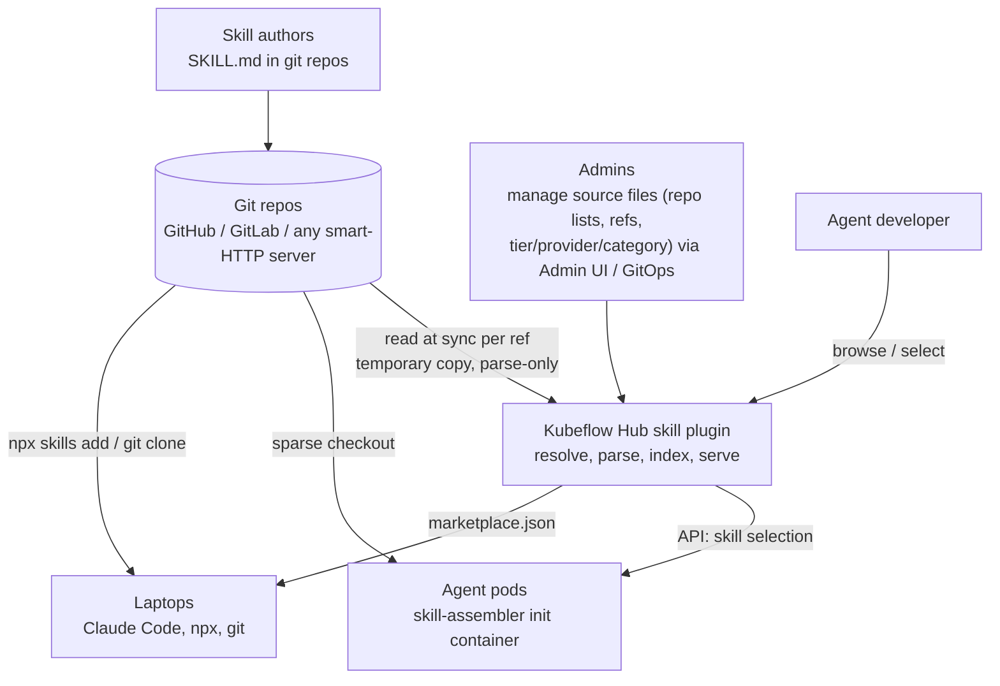
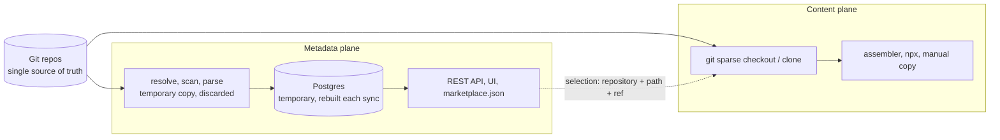
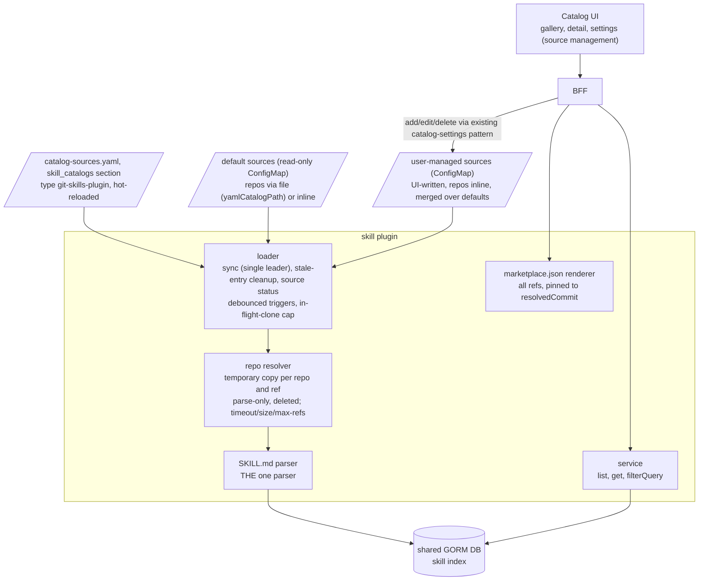
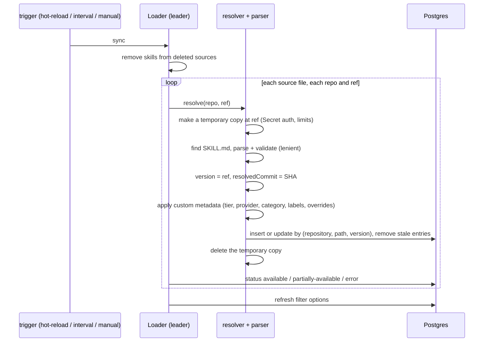
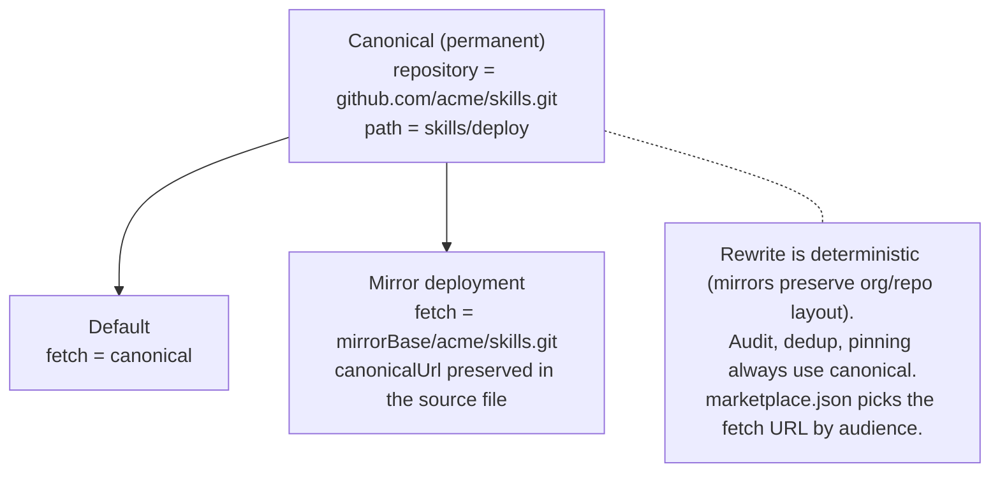
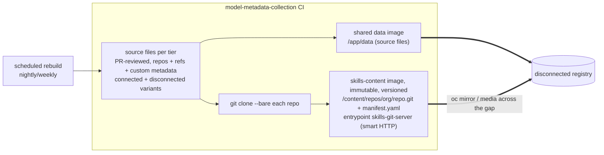
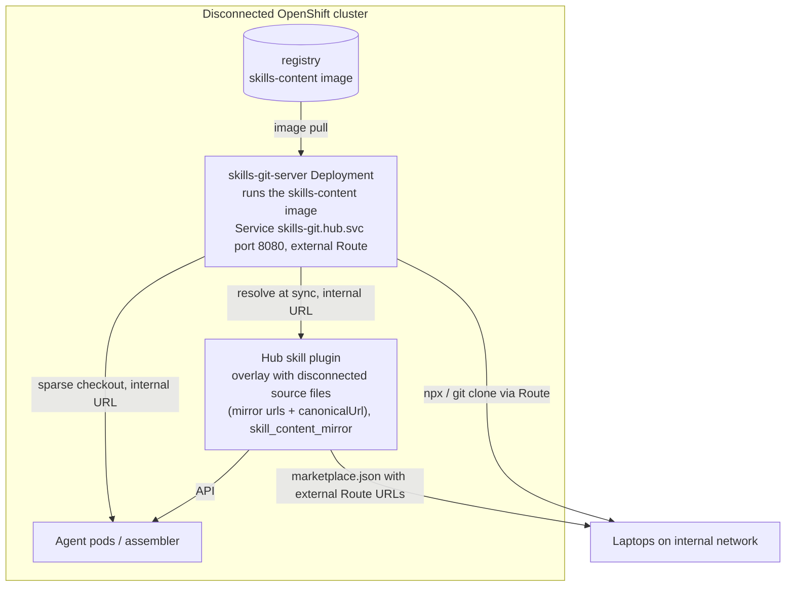

# Skill Catalog - High-Level Architecture

- **Part I - Core (upstream Kubeflow Hub, connected setup).** Everything in the Hub KEP. It works on its own anywhere the git sources can be reached.
- **Part II - Optional disconnected support.** A set of default source files plus a self-serving skills-content image (a container with a built-in git server). This is deployed only when the cluster cannot reach the source repositories. It adds **no code** to the Hub plugin: disconnected support is just configuration plus one optional Deployment.

**Governing principle:** git repositories are the only place skills actually live; everything else is a view onto them. Postgres is a temporary cache, rebuilt by reading git (temporary lightweight copies for parsing only; the repositories are never stored). The agent assembler checks skills out of the same repositories the catalog reads. There is exactly one SKILL.md parser, and it lives in Hub: Hub is the only component that needs skill *metadata*, while every other consumer takes skill *content* directly from git.

---

# Part I - Core Architecture 

## 1. System Context

## 2. Two Planes, One Meeting Point

Metadata (for browsing and choosing) and content (for obtaining and running) travel separately, and meet only at the canonical identity `(repository, path)`. Both planes read the same repositories, so they can never drift apart.

## 3. Hub Skill Plugin - Components

A new source type `git`, named after what it reads, following Hub's convention (`yaml`, `hf`). Its configured file lists git repositories, refs, and custom metadata - not pre-parsed skill data.

## 4. Sync Flow - Rebuilding the Temporary Index

## 5. Identity - Canonical vs Fetch URL

Internal IDs are not stable, since the index is just a cache. The canonical identity is the only permanent reference, and it stays the same even when a deployment reads through a different URL. `version` (the ref) tells entries apart - a branch surfaces as `latest`, and every entry records the commit it resolved to (`resolvedCommit`), which the marketplace pins to so installs are reproducible even for `latest`.

## 6. Custom Metadata - Who Sets Tier / Provider / Category

Custom metadata lives in the source files and is applied at sync time. It is never kept in the rebuildable index and never read from repository content. Source management reuses the existing model/MCP catalog-settings mechanism: read-only default sources merged with a user-managed ConfigMap that the settings UI writes via the BFF (auth as Secrets). Adding a skills git source through the UI works like adding a HuggingFace source for models; editing the ConfigMap directly (kubectl / GitOps) works too. `trustTier` is simply a label (`platformProvided`, `partnerVerified`, `organizationApproved`, or `communityContributed`), shown as a badge and available as a filter, with no ordering or special meaning.

| Entry path | Who | Sets |
|---|---|---|
| Default sources (read-only; Part II) | Platform team | All fields; read-only in the UI |
| User-managed sources (admin settings UI or kubectl / GitOps) | Catalog admins | All fields; UI writes the user-managed ConfigMap |
| `skillOverrides` on a repo entry | Either | Per-skill category/labels |
| SKILL.md `metadata` frontmatter | Skill authors | `customProperties` only, never tier/provider |

## 7. Consumers - Three Install Protocols

| Protocol | Input | Notes |
|---|---|---|
| `/plugin marketplace add <catalog-url>` | The catalog's `marketplace.json` | Claude Code + compatible agents; one add = whole curated catalog. Key feature |
| `npx skills add <repo-url>` | A **git repo** URL, never the catalog URL | Upstream repos, or the mirror Route (Part II) |
| Manual | `git clone` + copy | Into the agent's skills dir (`~/.claude/skills/`, `~/.agents/skills/`, ...) |

The skill detail page renders all three with environment-correct, copy-paste-ready URLs.

---

# Part II - Optional Disconnected Support (Self-Serving Skills-Content Image)

> Optional: deploy this only when the cluster cannot reach the source repositories (an air-gapped or disconnected setup). The air gap changes just one thing: both planes now need a git server running inside the cluster. The **skills-content image serves itself**: it carries copies of the repositories together with a built-in git server, so a single Deployment covers both planes (Hub resolves repositories from it, and the assembler checks skills out of it), keeping the no-drift guarantee intact. Hub's only change is configuration (the disconnected variant of the source files, plus `skill_content_mirror`).

## 9. Content Pipeline

A separate pipeline owns the **default source files from git repositories** and builds a **skills-content image** that contains copies of all the skills repositories.

- **Source files** are the same YAML configuration files from Part I - the ones that define each skill's metadata and git repository location.
- **The repository copies plus the git server** go into a separate, immutable `skills-content` image, pulled only in disconnected deployments. Its entrypoint is `skills-git-server`, a small Go binary (standard library only) that serves `/content/repos` over git's HTTP protocol via `git http-backend`. Run the image and it is a git server; mount or copy from it and it is just data.

The clones keep their upstream `{org}/{repo}` names, so everything lines up automatically: the mirror URL is just the canonical URL with its host swapped (github.com/acme/skills.git → {mirrorBase}/acme/skills.git), and the server serves each repository at that same path (/acme/skills.git → /content/repos/acme/skills.git). There are no lookup tables anywhere, and the org prefix keeps two repositories with the same name from colliding.

## 10. Serving the Mirror - Stateless by Construction

No PVC, no database, no loader Job, no admin credentials: the running image **is** the content it serves. To update the content, you roll the Deployment to a new image tag. The server is read-only by design: anonymous push is disabled in `git http-backend` by default, and the container filesystem is an immutable image layer. The attack surface is small - a minimal UBI base plus `git-core` plus a standard-library-only Go wrapper - with no web UI, auth system, or persistent state to attack.

One canonical identity, three URLs depending on the audience: in-cluster consumers use the Service URL, laptops use the Route URL, and all records (the assembly manifest and audit logs) keep the canonical upstream URL, so they stay comparable with connected deployments. Smart HTTP fully supports the operations the system needs: shallow clones, partial clones, sparse checkout, and npx.

*Note:* because the Hub plugin only ever sees URLs, any git host the cluster can reach (an internal GitLab, Gitea, and so on) can serve as the mirror instead. The self-serving image is simply the default when nothing else is available. Trade-offs accepted: no web UI for browsing repositories (the catalog UI handles skill browsing) and no way to push (the mirror is read-only by design).

---

## Design Invariants

| Invariant | Part | Consequence |
|---|---|---|
| Git is the only lasting store of content and source of metadata | I | Postgres can be dropped and rebuilt anytime; repositories are never stored in Hub |
| One parser (in Hub), fed by source files | I | Spec changes are implemented once; metadata refreshes from the repositories on every sync |
| Canonical identity `(repository, path)` plus ref-based versions | I | Audit and pinning stay comparable across rebuilds, deployments, and environments |
| Custom metadata comes from source files; UI edits are saved back to those same files | I | One durable format no matter how it was entered; labels are as trustworthy as admin/ConfigMap access |
| The catalog never writes to sources | I | One-way; the source repositories are authoritative |
| The assembler is harness-agnostic (driven by layout config) | I | New harnesses need only a layout entry, not a whole delivery system |
| Disconnected support = the self-serving content image plus configuration, with no plugin code | II | Upstream carries no deployment concerns; the gap is crossed by an immutable image that is also the server |
